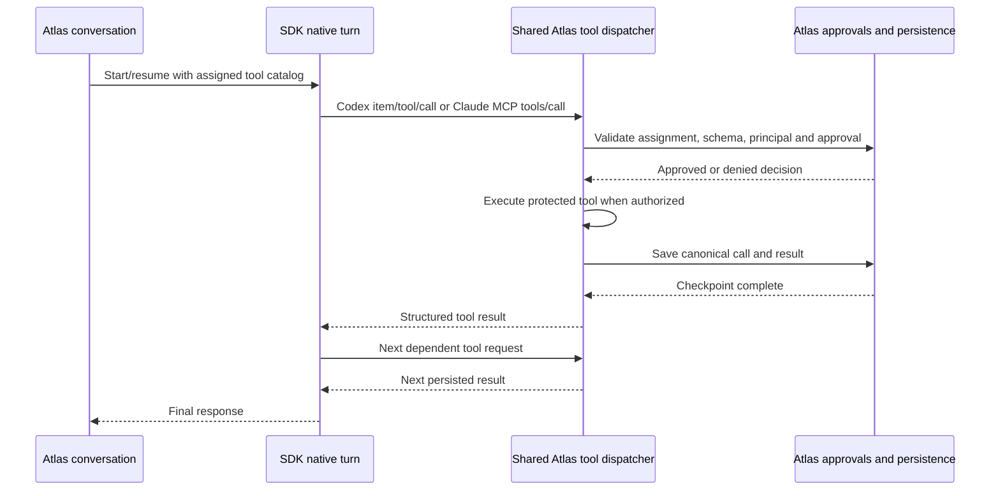

# ADR 0004 — Structured SDK tools in the Atlas conversation lifecycle

Status: accepted for the shared callback and Codex/Claude bridges; broader
registry changes remain proposals.

## Decision

Keep one Atlas conversation/action lifecycle. Add an optional tool execution
callback to `GenerateChatInput`, and implement Codex dynamic tool registration
and a Claude SDK MCP server behind the existing `ProviderClient`. API adapters
may still return `toolCalls`;
SDK adapters may await the callback while their native turn is running. Both
paths use the same protected executor, approval policy, transcript, artifacts,
and persistence boundary.

This extends ADR 0002: `native` remains evidence about upstream support. It does
not authorize tools, prove model support, or enable every builtin in an SDK.

## Existing architecture and remaining boundaries

- `packages/core/src/provider-catalog.ts` describes provider identity and setup.
  `apps/server/src/providers/capabilities/registry.ts` registers manifests,
  chat factories, discovery, and specialist executors. The resolver combines
  implementation availability with provider, model, and instance evidence.
- `ToolDefinition` declarations are assembled for a profile by `agent-service`.
  The agent loop dispatches them through `executeProtectedTool`. Tool assignment,
  argument validation, guest restrictions, and approval grants belong to Atlas.
- Media operations already use capability IDs and registered executors.
  Their execution context currently contains instance/model/API credentials;
  it does not carry the full conversation cancellation and approval context.
- SDK authentication, native sessions, and protocol translation remain specific
  to Codex or Claude. `subscription/runtimes.ts` still selects these two runtime
  types. This is a remaining extension point, not evidence of a capability.
- Native builtin configuration is deliberately explicit in each SDK adapter.
  Protocol-specific configuration can stay there; orchestration must not infer
  available actions from the provider's name.

Before this change, both subscription runtimes used text `atlas-tool-call`
blocks for Atlas tools. Codex now uses structured registration when the harness
supplies tools and its execution callback. Claude now registers the Atlas catalog
through its dedicated in-process SDK MCP server, using the same callback.

## Flow

The optional callback is an interaction mechanism, not a second run lifecycle.
Providers must not return executable calls they already dispatched. Tools are
serialized initially; matching call IDs and canonical action hashes reuse one
result within a provider turn. Conflicting reuse stops the turn. Atlas applies
its execution and no-progress limits to SDK callbacks too.

## Compatibility and failure behavior

- Pin bundled `@openai/codex` to `0.150.1`, negotiate `experimentalApi`, and verify
  the initialized runtime version before structured work. `dynamicTools` and
  `item/tool/call` are experimental. An unknown version fails before starting
  structured work; it does not retry through the text bridge.
- Pin `@anthropic-ai/claude-agent-sdk` to `0.3.247`. Its dedicated `atlas` MCP
  server publishes the assigned tools' original JSON schemas through public MCP
  request handlers. Missing registration support fails the structured turn;
  it does not silently use text blocks. Host settings and unassigned SDK tools
  remain disabled; only the registered Atlas MCP names are permitted.
- Tool catalogs are fingerprinted in native session bindings. Changed catalog
  or bridge mode starts a fresh native thread. Matching history and catalogs
  can resume the native thread. Codex still owns automatic context compaction.
- Approval is a live wait backed by an execution run, step, and approval record.
  Decisions recheck the session, tenant, requesting user, and tool configuration.
  A stored approval without a live waiter cannot claim it resumed execution.
- First-output detection recognizes approval requests. The HTTP inference
  deadline pauses during approval. Both Codex and Claude pause their native
  inference budgets while Atlas host callbacks are outstanding. Claude resumes
  the remaining cumulative budget after all callbacks finish; each callback does
  not reset the budget. Explicit caller cancellation/deadlines remain active, and
  approval itself has a 15-minute expiry.
- Completed tool pairs are checkpointed before the native reply is acknowledged.
  A disconnected runtime does not erase completed effects. A failed checkpoint
  stops acknowledgement and retains in-memory evidence for persistence recovery.
- Cancellation drains a started callback before releasing that chat session's
  send operation. Clearing history creates a new lifecycle: old effects cannot
  restore the cleared transcript. Stream publication and completion are scoped
  to the originating turn so an old stream cannot end its replacement.
- Approval step completion uses actual execution receipts, including failed
  outcomes, rather than the model's final wording. Missing evidence is marked
  unconfirmed; an unfinished approval expires when its live run ends.

This does not promise exactly-once effects across an Atlas process crash. There
is no durable pre-effect journal, reattachment of pending native RPC requests,
or automatic replay after restart. A tool which ignores cancellation can still
finish its effect; cancellation cannot undo that effect.

## Why not two public lifecycle contracts yet?

Separating one-shot operations and conversation runtimes into independent public
lifecycles would make session ownership, cancellation, authorization, and result
persistence cross two coordinators. The existing `ProviderClient` plus a callback
can handle the representative case without that split: a model consumes a tool
result, requests an approved mutation, verifies it, and then finishes its turn.

The cost is that a `generateChat`/`streamChat` call may now perform awaited host
actions. Adapters must honor callback errors and closure, and execution stays
serial for now. This is a smaller migration, but it still requires lifecycle
and transport tests. It does not imply every future streaming media capability
fits the existing one-shot media DTOs.

## Validation

Offline coverage exercises actual Atlas transport, runtime, harness, and
persistence layers with a simulated remote Codex process. It covers dependent
calls in one native turn, send/stream, native continuation, catalog changes,
ID conflicts, duplicate requests, invalid arguments, approval/denial, approval
cancellation, version rejection, failed persistence, process disconnect, and
late results after clear. The remote process simulation is not a live recording.

A manual live smoke test on 2026-09-06 used Atlas's existing isolated ChatGPT
login, bundled `codex-cli 0.150.1`, and advertised default model `gpt-5.6-sol`.
The runtime read a temporary fixture, passed its unpredictable receipt to an
approval-gated deletion, and verified absence. The fixture approval was resolved
by the test coordinator. Each of the three tools ran once; each result reached
the persistence wrapper; the approved execution step finished as `succeeded`.
Native and temporary fixture cleanup completed. The smoke test used an in-memory
database adapter; it did not exercise a browser approval button or a production
database. The sanitized [event trace](validation/0004-codex-live-trace.json)
contains no account identifiers or credentials.

A second live Codex validation used the same pinned runtime with actual Atlas
file tools: 24 structured callbacks across four dependent DOCX, PPTX, XLSX and PDF
tasks. Independent checks verified document and slide edits, spreadsheet
recalculation, PDF merge/text extraction and preserved original files. Calls and
persisted tool results matched. The sanitized
[daily-file trace](validation/0004-daily-files-native-trace.json) records this
broader execution case; it does not establish arbitrary Office-feature fidelity.

Claude's structured bridge passed 46 protocol/runtime tests with 149 assertions
across five files, using the installed SDK and actual in-memory MCP transport.
Coverage includes exact schema registration,
dependent callbacks, duplicate/conflicting IDs, approval errors, cancellation and
session/catalog continuation. Three deterministic SDK/MCP regressions verify
cumulative inference-budget accounting, pausing during outstanding host calls,
and caller cancellation while paused. No live Claude subscription inference was performed:
Atlas's isolated runtime reports Claude Code `2.1.247` as `not_authenticated`.
The readiness check did not initiate login or copy credentials from the host's
Claude configuration.
Channel adapters were tested with fixture bytes and mocked sends; the live web
upload/reload/download QA used a localhost mock model. Neither result is a live
channel-delivery or comparative reasoning benchmark.

## Next validation gates

1. Authenticate Atlas's isolated Claude runtime, then run live subscription
   inference against the structured bridge. The current direct status check
   returns `authenticated: false` for Claude Code `2.1.247`. The
   installed SDK 0.3.247 and actual in-memory MCP transport already pass dependent
   calls, approval errors, cancellation, duplicate IDs, and continuation tests.
   MCP request IDs (namespaced per turn) identify canonical Atlas calls; the model's
   private tool-use ID is not inferred from text. The runtime is pinned and fails
   without falling back if registration is unavailable.
2. Extend media execution context with only the invocation data its handlers need
   (signal, tenant/session identity, artifact handling). Validate a conversational
   media operation before deciding whether a richer public operation contract is
   necessary. Existing image generation alone is insufficient evidence.
3. Consolidate runtime factories/discovery into adapter registration after the
   live Claude gate validates the observed common fields. Keep upstream/model evidence,
   transport readiness, assigned tools, and per-action permission distinct.

Hermes-style reasoning and OpenClaw-style channel behavior remain separate product
work. A provider-neutral harness makes them easier to integrate, but this bridge
alone does not establish comparable reasoning quality or channel experience.

## Daily-file readiness follow-up

The [daily document and data audit](../architecture/daily-file-readiness.md)
identified reproducible CSV/formula integrity failures and incomplete document
workflows. Atlas now implements registered file engines, preserves original
attachment bytes and provides bounded document operations and explicit unsupported
results. Complex XLSX packages are limited to metadata inspection when safe
roundtrip editing cannot be established. The audit records runtime dependencies,
form/OCR coverage gaps, publication concurrency limits and live UI evidence.
These remain separate acceptance gates from SDK tool registration.
