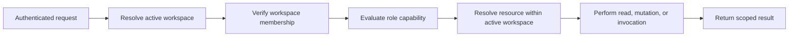

# Authorization Flow

Status: Reviewed

Resource lookup failures and cross-workspace mismatches return the same
not-found result. This prevents IDs from becoming a workspace-enumeration
channel.

## Negative paths

- No active workspace: reject before route logic.
- No membership: reject before route logic.
- Insufficient role: return a role-specific 403 response.
- Resource belongs to another workspace: return 404.
- Viewer attempts an invocation: return 403 before contacting a provider.
